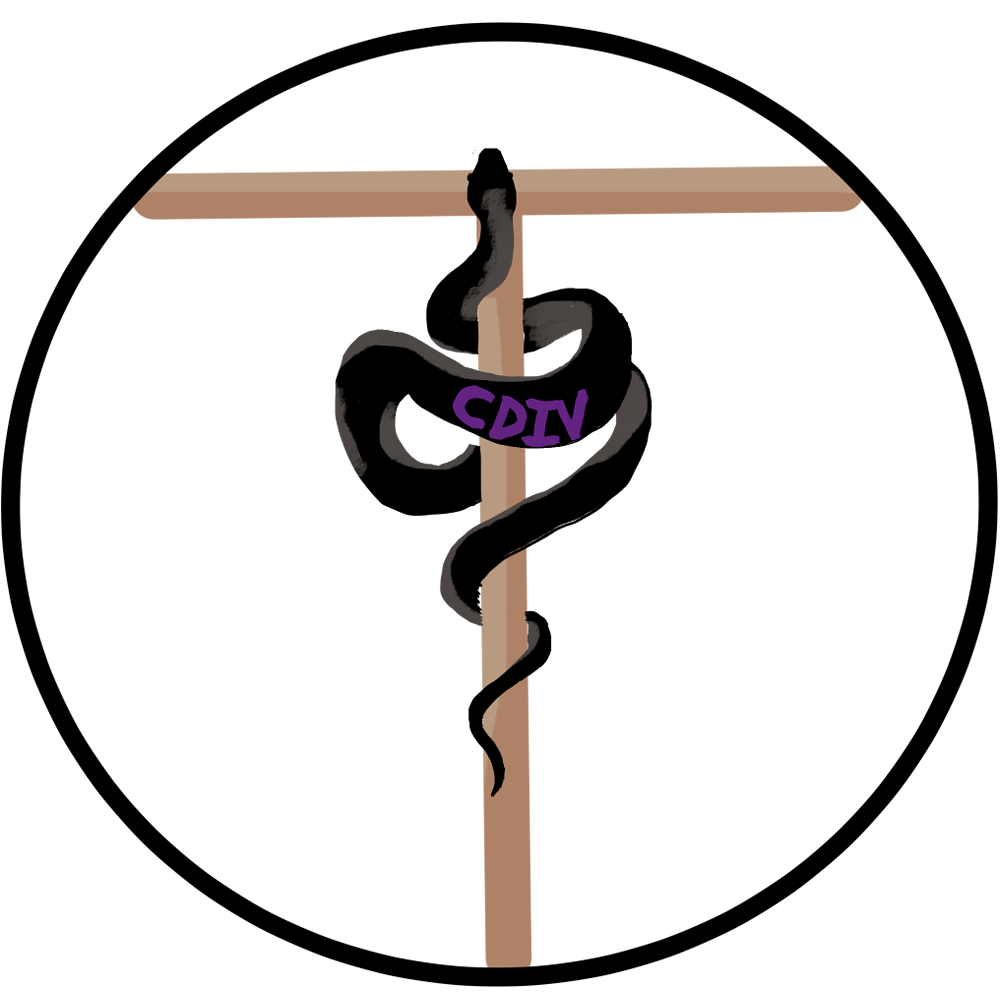

<p align="center">
  <a href="https://github.com/JoannaAtMarist/404pnf/tree/main/docs" title="Project documentation">
    
  </a>
</p>  

# 404 Patient Not Found — AI‑Powered Clinical Note Summarizer

> Educational prototype for summarizing clinical notes with AI. **Not for clinical use.**

<p align="left">
  <a href="https://img.shields.io/badge/status-prototype-blue">
    
  </a>
  <a href="#license">
    
  </a>
  <a href="https://nodejs.org/en">
    
  </a>
  <a href="https://expressjs.com/">
    
  </a>
  <a href="https://www.mongodb.com/">
    
  </a>
  <a href="https://auth0.com/">
    
  </a>
  <a href="https://platform.openai.com/docs">
    
  </a>
</p>

---

## Overview
**Patient Not Found (PNF)** is a web application that helps clinicians generate structured summaries from patient notes. It utilizes a secure AI pipeline to redact Protected Health Information (PHI) before processing, ensuring privacy-conscious summarization.  

## Status
Prototype / User‑testing only (synthetic or de‑identified data).

## Features
- Typed & file‑based input (PDF/DOCX)
- Redaction‑first flow, **editable** summaries
- PDF/Word export
- Auth0 login (hosted login), session‑backed
- Audit logging (metadata only; no PHI)
- Source‑text **Highlights** & **Confidence Flags**  

## Project Management & Methodology
This project followed a rigorous planning lifecycle to manage scope and technical complexity:
* **Dynamic WBS:** Work was broken down into weekly sprints, with major re-evaluations pre and post-demo to adapt to resource constraints (see `docs/project-management/`).
* **Documentation First:** Requirements and architecture were defined *before* implementation to ensure the AI pipeline met privacy standards.
* **Risk Management:** The project plan was iteratively updated to adapt to changing technical constraints and development velocity.  

## Tech Stack
Node.js + Express · Frontend JS/HTML/CSS (Patrick’s layout) · MongoDB (Mongoose) · Auth0 (OIDC) · OpenAI API · Swagger UI

## Quickstart
```bash
npm install
node server/server.js
# App:     http://localhost:3000
# Swagger: http://localhost:3000/api-docs
```
> Configure environment via `.env` (see `.env.example`).

## Repo Structure
```
client/   # UI (views, css, js)
server/   # Express API, Auth0, sessions, routes
docs/     # Requirements, design, and official deliverables
```

## Documentation
See `/docs/` for system design, requirements, and deployment notes.
- Index: `docs/documentation-index.md`

## Security & Privacy
- Prototype; no HIPAA alignment or BAA.
- No PHI stored; logs contain metadata only (user, route, timestamps).

## Authors

- **Joanna Picciano** — *Project Manager & Lead Backend / AI Integration*  
   Designed and implemented the full backend (Express/Mongo), AI pipeline (OpenAI & local), and prompt engineering; upload parsing and export, session/audit logging, and documentation. Managed DevOps, repo structure, documentation, and system integration.

- **Patrick Daileg** — *Testing Lead & Frontend Developer* 
  Finalized UI layout, built core pages and navigation, drove manual testing across datasets, supported accessibility/UX polish, authored the System Architecture (3.4) diagram.  

- **Alondra Trejo Palma** — *UI/UX Designer & Auth Integration*   
  Implemented Auth0 end-to-end (OIDC flow, session wiring), contributed CSS/HTML layout, produced diagrams, and ran local LLM experiments to inform model choices.  

- **Samuel Wu** — *Full-Stack Support & QA*   
  Implemented and maintained session handling logic and state persistence, provided extensive debugging across both backend routes and frontend interfaces, test assistance, HIPAA and documentation updates.

<br> 

**Faculty Advisor:** Professor Juan Arias

## License
Educational use only.

